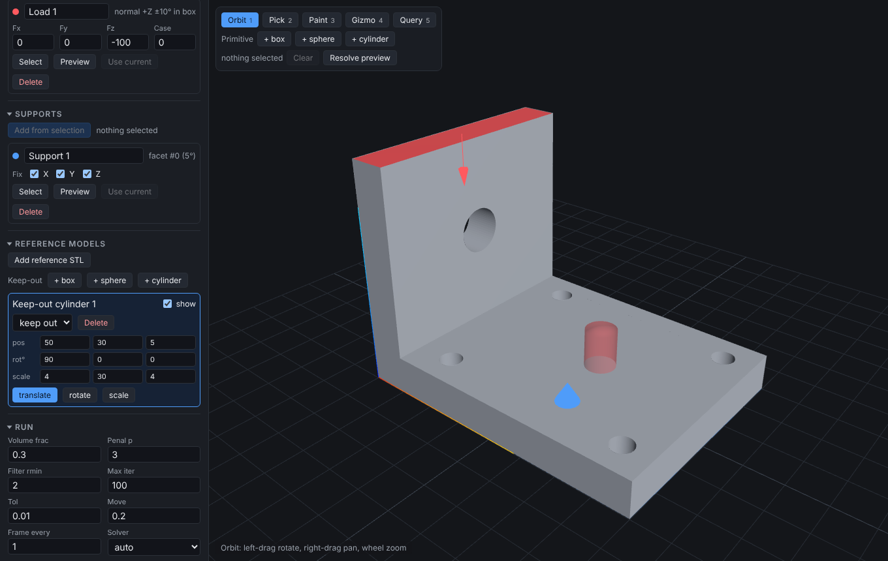
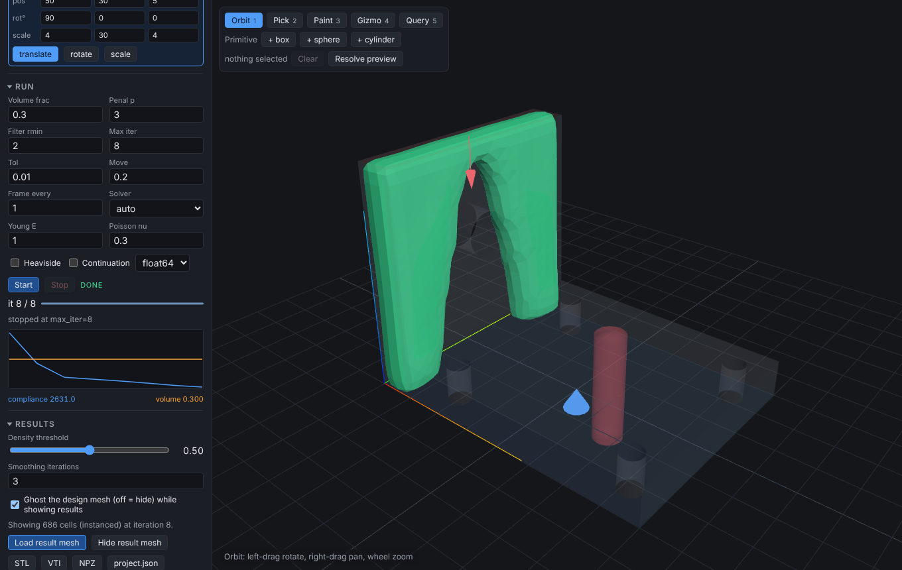

# top-op

Voxel SIMP topology optimization for your own 3D models. Import an STL, mark where it is held and
where it is pushed, run, and export the optimized shape as an STL. It comes with three front ends over
the same engine: a browser GUI, a CLI for scripted runs, and an MCP server so a Claude session can
drive the whole workflow without the GUI.

Python (numpy/scipy) core, FastAPI server, Three.js frontend. One run at a time, on the CPU. No cloud.





The second shot is a deliberately short 8-iteration run (`max_iter = 8`) with a coarse 24-element grid.

## Install (macOS arm64, M1)

```
brew install uv node        # node is only needed to rebuild the frontend
git clone https://github.com/grint0uc/top-op
cd top-op
uv sync
uv run topop serve          # http://localhost:8000
```

The built frontend is committed (`topop/server/static/`), so `uv sync` is enough to run the GUI.
`uv` fetches Python 3.12+ on its own. Rebuild the frontend with `make build` (needs node 22).

## GUI workflow

1. **Import**: choose an STL or drop it on the page. The panel shows faces, size, volume and whether the
   mesh is watertight (non-watertight meshes voxelize poorly).
2. **Domain**: set "elements along longest" (the resolution). The panel shows grid size, active elements,
   estimated memory and time per iteration; amber above 150k active elements, red above 300k.
   Debug at 30-40, refine to 60-100 at the end.
3. **Select** a region with one of: Pick (click = face, shift+click = grow the flat face, ctrl+click =
   remove), Paint (brush over faces), Query (facets / normal / plane forms, same as the agent's), or a
   primitive (+ box, + sphere, + cylinder with a gizmo and numeric fields). "Resolve preview" shows the
   grid nodes the selection hits. Zero nodes means it missed.
4. **Loads and supports**: "Add from selection" in the Loads or Supports panel. Loads take a total force
   vector (split over the nodes) and a load case; supports fix X/Y/Z. Supports must stop all rigid motion.
5. **Reference models** (optional): add an STL or a generated box/sphere/cylinder, move it with the gizmo,
   set it to *keep out* (forced void, clearance) or *keep in* (forced solid, extends the domain).
6. **Run**: set volume fraction, penalty, filter radius `rmin`, max iterations, then Start. Density
   updates live in the viewport; the plot shows compliance (blue, log) and volume (orange). Stop keeps
   the partial result.
7. **Results**: the density threshold slider and smoothing control the surface; "Load result mesh" shows
   the marching-cubes surface over the ghosted design.
8. **Export**: STL (threshold + smoothing as set), VTI (density field), NPZ (raw), `project.json`
   (reloads in the GUI via "Load project.json" and re-runs with `topop run`).

Hotkeys 1-5 switch Orbit / Pick / Paint / Gizmo / Query. Projects persist in `~/.cache/topop`
(`TOPOP_DATA_DIR` to move it).

## Headless

```
uv run topop describe examples/bracket.stl                     # bbox + facet table, largest first
uv run topop describe examples/bracket.stl --png bracket.png   # plus a preview render
uv run topop run examples/bracket.json --out out/              # 40 iterations, about 16 s
```

`topop run` writes `result.stl`, `result.png`, `result.vti`, `density.npz` and `run.json` (re-runnable).
Exit codes: 0 done, 1 failed, 2 invalid case, 3 out of memory. Flags: `--max-iter`, `--resolution`,
`--threshold`, `--smooth`, `--quiet`. A case file is the project JSON with meshes as `path`s; see
`examples/bracket.json` (facet support, normal-query load, keep-out slot) and `examples/README.md`.

## Claude / MCP

```
claude mcp add top-op -- uv run --directory /path/to/top-op topop mcp
```

Tools cover the whole workflow: `load_mesh`, `describe_mesh`, `preview_mesh`, `create_project`,
`add_load`, `add_support`, `add_ref_model`, `set_params`, `set_grid`, `voxel_stats`, `run`,
`result_preview`, `export_stl`, and more. A session looks like this:

```
you:    Optimize examples/bracket.stl. Fix the plate bottom, push the wall's outer face in +X, keep 30 %.
claude: load_mesh + describe_mesh -> facet 0 is the plate bottom (4687 mm2, -Z), facet 2 the wall outer face (-X).
claude: create_project(40 elements), add_support(facets [0]), add_load(normal -X within the upper wall, 100 N).
claude: voxel_stats shows both selections resolved to nodes; run(max_iter=5) as a smoke test, then run(40).
claude: result_preview(iso) looks like two legs around the hole; export_stl(run_id, "out/bracket.stl").
```

Details, pitfalls and the `.mcp.json` form: [docs/AGENT.md](docs/AGENT.md). Runs made through MCP or the CLI
share `TOPOP_DATA_DIR` with `topop serve`, so they open in the GUI.

## Selections

Loads and supports take a selection, resolved on the server to grid nodes. Coordinates are in the
mesh's own units. `mesh_id` defaults to `"design"` (`"ref:<id>"` names a reference model).

| kind | what it picks | JSON |
|---|---|---|
| faces | raw triangle ids (GUI clicks and paint) | `{"kind":"faces","face_ids":[12,13,40]}` |
| facets | coplanar face groups from `describe` | `{"kind":"facets","facet_ids":[0],"angle_deg":5}` |
| normal | faces pointing along a direction | `{"kind":"normal","direction":[0,0,1],"angle_deg":10,"within":[[x0,y0,z0],[x1,y1,z1]]}` |
| plane | grid nodes on a plane, no mesh needed | `{"kind":"plane","point":[0,0,0],"normal":[1,0,0],"tol":0}` |
| box | surface nodes inside a box | `{"kind":"box","min":[0,0,0],"max":[10,60,20]}` |
| sphere | surface nodes inside a sphere | `{"kind":"sphere","center":[5,30,60],"radius":8}` |
| cylinder | surface nodes inside a cylinder | `{"kind":"cylinder","center":[40,30,10],"radius":6,"height":14,"axis":"z"}` |

The `within` box clips on node coordinates, and nodes sit up to h/2 outside the true surface: pad a box
derived from the mesh bbox by one voxel per side. Facet ids are ranks by area for a given `angle_deg`.

**Units.** None are enforced. Whatever the mesh is in (the examples are mm) is the length unit; E,
forces and lengths must be consistent. Compliance comes out in those units and is only comparable between
runs of the same setup, not across resolutions. Default `E = 1`, `nu = 0.3`.

## Performance

Measured on a shared 4-core x86_64 Linux box (4 vCPU, 15 GB, load average 2-7, so single timings scatter
up to 2x), not on the M1. Time is per whole iteration (assembly, solve, sensitivities, filter, OC),
iterations 2-6 to 2-30. Re-measure on the M1 with `uv run pytest tests/test_perf.py`; it also recalibrates
the time estimate shown in the GUI.

| active elements | grid | s/iteration | setup | peak RSS (float64 / float32) |
|---:|---|---:|---:|---|
| 4 800 | 60x20x4 | 0.14 | 0.1-0.5 s | 0.25 GB / not measured |
| 100 000 | 50x50x40 | 1.5-2.1 | 5.0 s | 1.5 GB / 1.2 GB |
| 250 880 | 80x56x56 | 3.8-4.3 | 13.7 s | 3.6 GB / 2.8 GB |

Targets for the M1: 100k <= 6 s/iteration; 250k <= 20 s/iteration and <= 8 GB. The memory guard refuses
a run whose estimate exceeds 6 GB (roughly 400k elements; 1M is estimated at 13.8 GB) and `run` fails fast
with exit code 3. Design for up to about 250k active elements; keep <= 150k on a 16 GB machine.
Solver details: [docs/PERF.md](docs/PERF.md).

## Known limitations

- The boundary is stair-stepped: resolution is the only fix. Smoothing on export is cosmetic. Features
  thinner than about 2 voxels vanish, and `rmin` limits the smallest member.
- Facets chain through fine tessellation and fillets: neighbouring triangles within the angle tolerance
  merge, so a filleted or finely tessellated surface can become one huge facet (shown with normal 0).
  Check area and bbox in `describe`, lower `angle_deg`, or use `normal`, `plane` or a primitive.
- A non-identity `design_mesh.transform` in an imported `project.json` is not drawn correctly by the
  viewport. The GUI never writes one.
- Not in v0.1: stress constraints, MMA or multiple constraints, symmetry planes, overhang constraints,
  STEP import, tet meshes, contact, GPU.
- One run at a time per process; further runs queue.

## Layout

```
topop/
  cli.py            serve | run | describe | mcp
  agent.py          headless Session shared by the CLI and the MCP server
  mcp_server.py     MCP tools over the same API
  core/             pure numpy/scipy, no web imports (contract: problem.py)
    fem.py solver.py filters.py optimize.py   hex8 FEM, multigrid/banded solve, density filter, OC loop
    voxelize.py selection.py export.py        mesh -> grid, selections -> nodes, marching cubes / VTI / NPZ
  server/           FastAPI (contract: schemas.py -> openapi.json -> web/src/api/types.gen.ts)
    static/         built frontend, committed
web/                React panels + vanilla Three.js viewport (src/), Playwright specs (e2e/), mock API (mock/)
tests/              pytest (core, server, CLI, MCP, perf)
examples/           cantilever and bracket STLs + case files (make_examples.py regenerates them)
docs/               PLAN.md, AGENT.md, PERF.md
```

## Development

```
make install     uv sync --all-groups and npm ci
make test        full pytest              make test-fast   pytest -m "not slow"
make lint        ruff check + format check + web typecheck
make check       lint + test-fast (the pre-commit gate)
make build       frontend into topop/server/static/ (commit the result)
make dev         uvicorn --reload on :8000 and Vite dev server (proxies /api)
make e2e         Playwright: both projects    make e2e-mock  UI against web/mock
make e2e-real    UI + real server on :8765    make types     regenerate types.gen.ts from the API
```

Conventions (grid ordering, transforms, wire formats) are in [CLAUDE.md](CLAUDE.md).

## Docs

- [docs/PLAN.md](docs/PLAN.md): design, API contract, work packages, v0.1 status.
- [docs/AGENT.md](docs/AGENT.md): driving top-op from a Claude session (MCP and CLI).
- [docs/PERF.md](docs/PERF.md): solver performance work and measurements.
